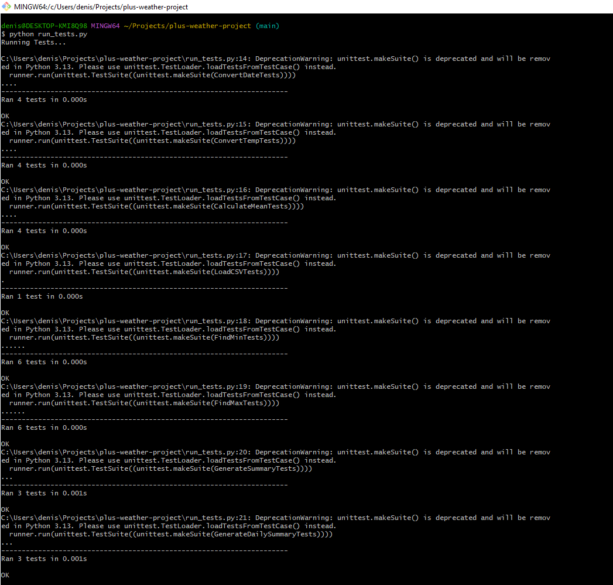

# Python Weather Project
This Python Weather App was created as part of She Codes Australia Plus Program | 2023-2024 Cohort.

## About
Everyday we collect data about the weather in order to predict the forecast for the coming days. The problem is that this data is never in a human readable format. 

## Project Requirements
The project task was to process weather data in csv files, converting them into meaningful text based summaries. The code was run against tests for validation and expected output 

## Tasks
- [X] Task 1 - Takes a temperature and returns it in string format with the degrees and celcius symbols.
- [X] Task 2 - Converts and ISO formatted date into a human readable format.
- [X] Task 3 - Converts an temperature from farenheit to celcius.
- [X] Task 4 - Calculates the mean value from a list of numbers.
- [X] Task 5 - Reads a csv file and stores the data in a list.
- [X] Task 6 - Calculates the minimum value in a list of numbers.
- [X] Task 7 - Calculates the maximum value in a list of numbers.
- [X] Task 8 - Outputs a forecast summary for the given weather day range: min and max temps with respective date, average low and high temps.
- [X] Task 9 - Outputs a daily weather summary for the given date range: date, minimum and maximum temps.

### Results

